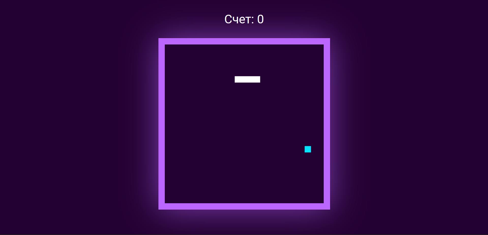
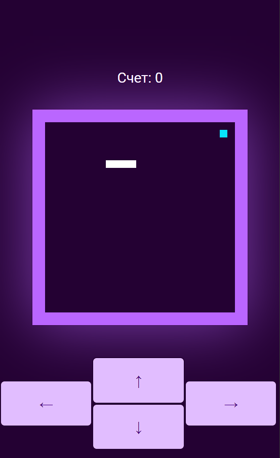

# Змейка

## Table of contents

- [Обзор](#Обзор)
  - [Цели](#Цели)
  - [Изображения](#Изображения)
  - [Ссылки](#Ссылки)
- [Процесс](#Процесс)
  - [Разработано спомощью](#Разработано-с-помощью)
  - [Что я узнала](#что-я-узнала)
  - [Полезные ресурсы](#Полезные-ресурсы)

## Обзор

Классическая игра Змейка в неоновом стиле.

### Цели

Во время разработки ставились следующие цели:

- Оптимальный вид в зависимости от устройства
- Игра в Змейку
- Оповещение об окончании игры
- Подсчет очков
- Ускорение после съедения яблока

### Изображения

### Ссылки

- [Ссылка на исходный код](https://github.com/annieremeeva/snake)
- [Ссылка на сайт-игру](https://annieremeeva.github.io/snake/)

## Процесс

### Разработано с помощью

- HTML5
- CSS
- Flexbox
- Mobile-first workflow
- Javascript

